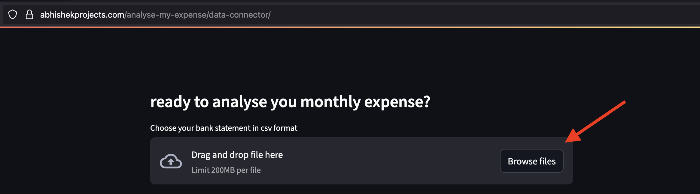
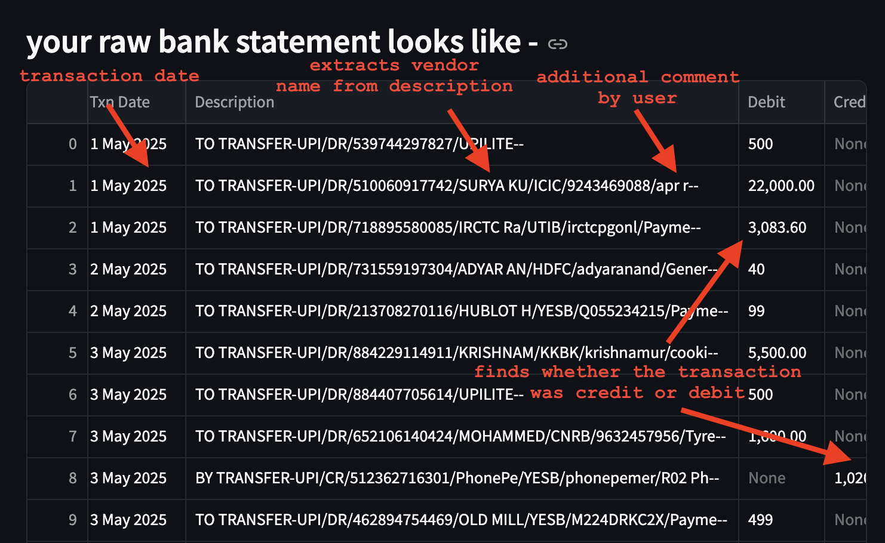
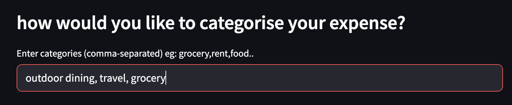
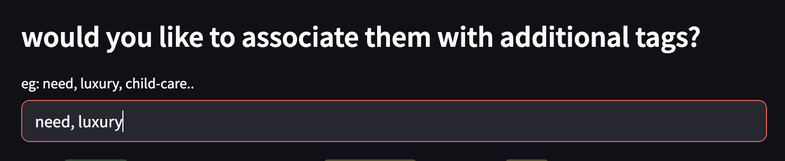
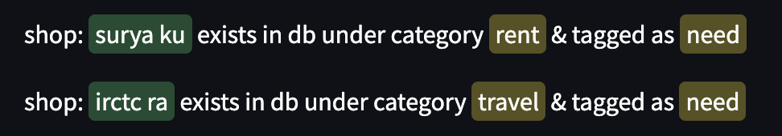
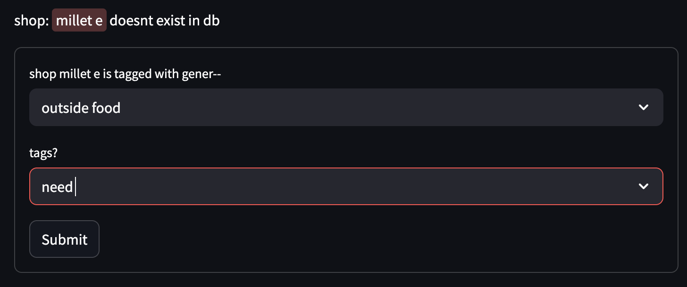
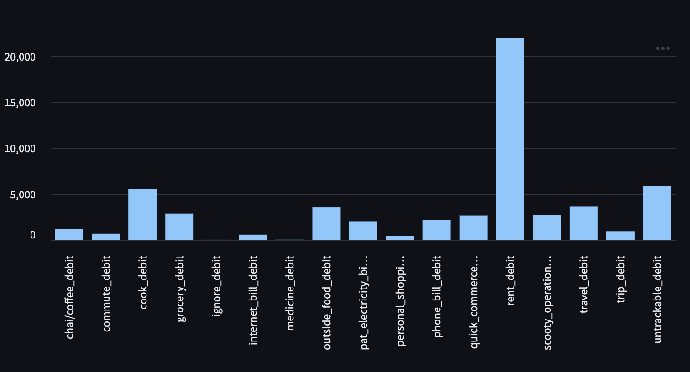
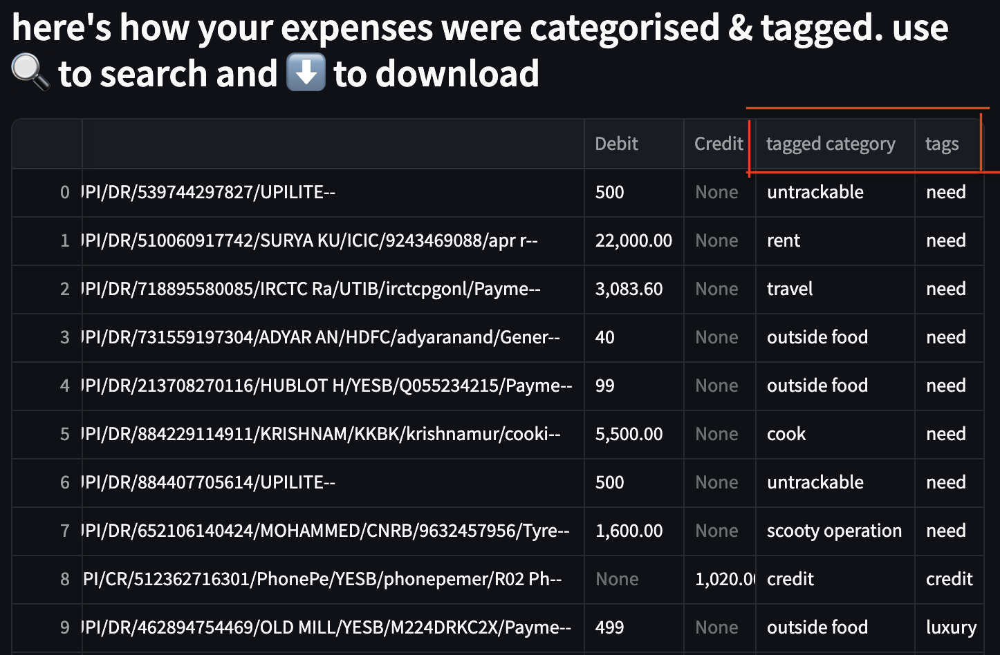
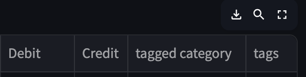

# Workflow

Bank statements are filled with sensitive information and this application is designed to treat them the appropriate way.


Here is how the workflow looks like, from providing your transaction statements to retrieving analytics based on those transactions -

0. First and foremost, when you hit https://abhishekprojects.com/analyse-my-expense/data-connector/ a pop-up will appear about security aspects of this application.
1. You are encouraged to remove account number, IFSC code, your name and everything that could be PII. This application only requires transactions, its date, credit/debit information.
2. Connection between your device (laptop/phone/tablet) & this application's server is encrypted. No data flow through network in plain-text.
3. Unless you decide to share your transactions with server, nothing will be stored. Initial categorisation and analytics is provided to you from server's memory (ie nothing goes to disc storage). You can verify this by closing the tab and reopening it, all the data that you had previously entered will be gone.
4. Remove PII from your bank statement and upload using the button ```browse files``` 
5. You will be shown the file you uploaded in raw format 
6. You can list your expense categories next, as comma separated values. Example: grocery, travel, shopping, rent, etc. 
7. If you need to add additional tags to perform advance analytics, you can enter them next. For example, it could be need, luxury, childcare, etc. 
8. Now, this application starts reading your transactions one-by-one. If it has seen expense shop details before, it will automatically pick-up the category from its database.  
9. If it sees something new, you will be prompted to enter the expense's category (and tags if you wish to). TYhe list you had entered in steps 6 & 7 will show-up as dropdown. 
10. After every transaction is read, you will be presented with a graph showing expenses in each category  and updated sheet showing how application used category and tags to provide this graph. 
11. If this all you are looking for - please feel free to download graph (or newly created sheet) and store in local for future checks and close the tab. 
12. If you are looking to get answers to questions like - how has been my grocery bills rising in last 6 months; or how much did I spent on luxury items last month; or what expense do I need to cut to keep my investments/loan repay plan unaffected by end of year - please send the transactions to firefly-iii.  
13. Firefly-iii is an open-source solution developed by James Cole (https://www.firefly-iii.org/). Credits to James Cole for developing such amazing application and kudos to open-source community for maintaining it.
14. I have hosted an instance of firefly-iii on my server to help my friends and family (who work in domains other than technology) with their finances. (https://budget.abhishekprojects.com/)
15. Every user will be asked to authenticate themselves before entering firefly-iii. 